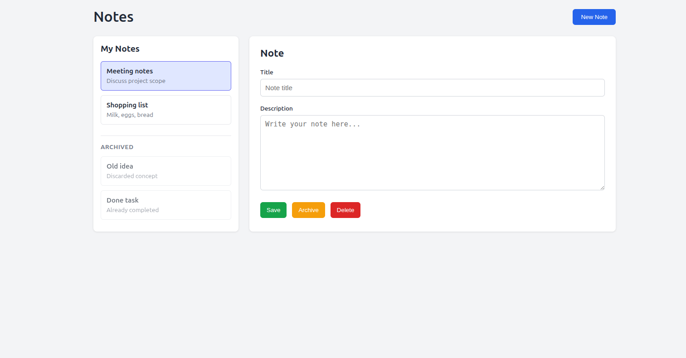

## Notes App – FastAPI + JS

This project is a simple Notes application built with FastAPI on the backend and HTML/CSS/JavaScript frontend.
It follows a clean, layered architecture on the backend and keeps the frontend intentionally simple to focus on clarity.


---

### Running the Project
#### Make the script executable
```bash
chmod +x run.sh
```

### Useful URLs

#### API documentation (Swagger UI)
```
http://127.0.0.1:8000/docs
```

#### Application UI
```
http://127.0.0.1:8000/
```

---

### AI Usage / Vision

AI tools were used during development, mainly to:

- Speed up HTML and CSS creation
- Generate boilerplate code faster

However, AI was used with clear criteria and intent.
All architectural decisions, data flow, and logic design were consciously defined beforehand.
AI acted as an accelerator, not as a substitute for understanding or decision-making.


--- 

### Project Structure
```pgslq
backend/
├── app/
│   ├── api/
│   ├── services/
│   ├── repositories/
│   ├── models/
│   ├── schemas/
│   └── db/
└── main.py

frontend/
├── index.html
├── styles.css
└── app.js

requirements.txt
run.sh
```

#### Backend (backend/)

The backend is built with FastAPI + SQLModel, following a clear separation of responsibilities.

- app/api/
    - Defines the HTTP routes (controllers).
Each endpoint handles request/response logic and delegates business logic to services.

- app/services/
    - Contains the business logic.
    - Services decide what should happen but do not deal with database details.

- app/repositories/
    - Handles all database operations (CRUD).

- app/models/
    - SQLModel database models that represent database tables.

- app/schemas/
    - Pydantic schemas used for request and response validation

- app/db/
    - Database configuration, engine creation, and session management.


- main.py
    - FastAPI application entry point.
    - Initializes the app, mounts the frontend, includes routers, and runs startup logic.

#### Frontend (frontend/)

The frontend is intentionally simple and framework-free.

index.html
Main UI layout.

styles.css
Styling for the application.

app.js
Handles API calls, DOM manipulation, and user interactions.

The frontend communicates with the backend via JSON over HTTP.

---

### References

- [FastAPI SQL databases tutorial](
https://fastapi.tiangolo.com/es/tutorial/sql-databases/#create-the-app-with-a-single-model)

- [SQLModel relationships](
https://sqlmodel.tiangolo.com/tutorial/relationship-attributes/)

### Note

I had used FastAPI only once about two years ago before this project.
This project demonstrates my ability to quickly adapt to new tools and frameworks, even when they haven’t been part of my recent daily stack.